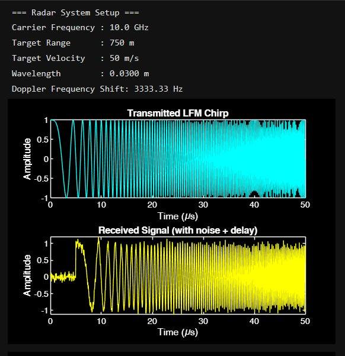
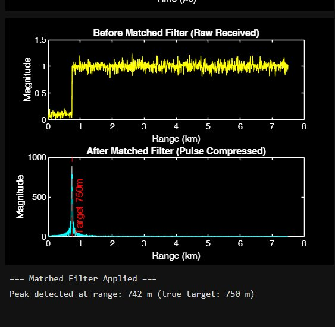
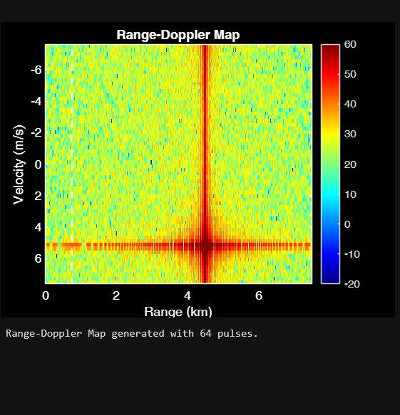
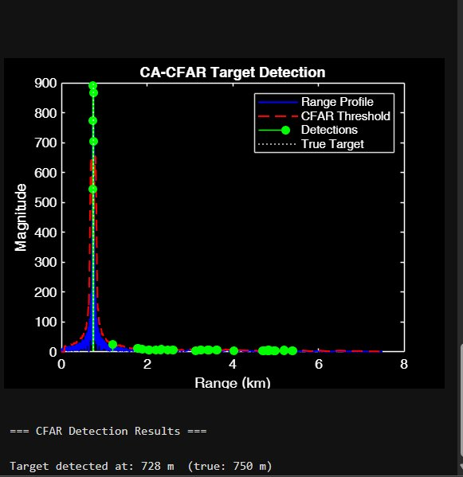

# Radar Signal Processing — MATLAB

Simulation of a pulsed Doppler radar system built in MATLAB.

## Project Overview
Simulated an X-band (10 GHz) pulsed Doppler radar to detect a target 
at 750m range moving at 50 m/s. Implemented the full signal processing 
chain from pulse generation to target detection.

## Techniques Implemented
- LFM (Linear Frequency Modulated) Chirp pulse generation
- Matched Filter based pulse compression
- Range-Doppler Map using 64-pulse coherent processing  
- CA-CFAR (Cell Averaging CFAR) target detection

## Results
| Parameter | Value |
|-----------|-------|
| Carrier Frequency | 10 GHz (X-band) |
| Target Range (true) | 750 m |
| Target Range (detected) | 742 m |
| Target Velocity | 50 m/s |
| Doppler Shift | 3333.33 Hz |
| CFAR Detection | Successful |

## Output Plots
### LFM Chirp + Received Signal

### Matched Filter — Pulse Compression  

### Range-Doppler Map

### CA-CFAR Target Detection

## Tools
MATLAB Signal Processing Toolbox

## Applications
Signal processing concepts used here are directly applicable to:
- Radar and sonar systems
- Electronic Warfare (EW)
- Avionics and defence electronics
- FPGA/SoC based DSP implementation
